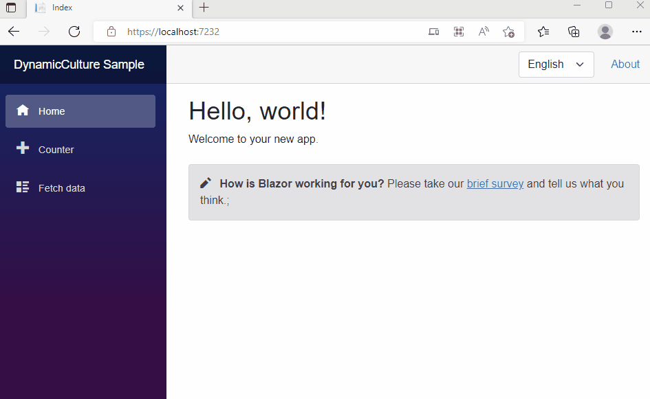

# Blazor.WebAssembly.DynamicCulture

[](https://www.nuget.org/packages/Blazor.WebAssembly.DynamicCulture/)
[](https://www.nuget.org/packages/Blazor.WebAssembly.DynamicCulture/)
[](https://github.com/ScarletKuro/Blazor.WebAssembly.DynamicCulture/blob/master/LICENSE)

A comprehensive localization solution for Blazor WebAssembly that enables dynamic culture switching without page reloads. This library replicates the functionality of `.UseRequestLocalization` from Blazor Server for Blazor WebAssembly applications.

## 📢 Important Notice: Native Blazor Alternative

**Blazor now provides a native way to load all satellite assemblies** in WebAssembly applications. You can configure this in your `index.html`:

```html
<!-- index.html -->
-<script src="_framework/blazor.webassembly.js"></script>
+<script src="_framework/blazor.webassembly.js" autostart="false"></script>
<script>
+   Blazor.start({ 
+       configureRuntime: runtime => runtime.withConfig({ 
+           loadAllSatelliteResources: true 
+       }) 
+   })
</script>
```

**This native approach may reduce or eliminate the need for this library** depending on your requirements. However, this library still provides additional features such as:
- Culture providers (QueryString, LocalStorage, AcceptLanguageHeader)
- Automatic component refresh on language change
- Simplified culture management API
- No need to manually configure Blazor startup

Evaluate your project needs to determine if the native solution or this library better fits your use case.

## 📦 Packages

This repository contains two NuGet packages:

### 1. [Blazor.WebAssembly.DynamicCulture](https://www.nuget.org/packages/Blazor.WebAssembly.DynamicCulture/)
[](https://www.nuget.org/packages/Blazor.WebAssembly.DynamicCulture/)

The main package providing dynamic localization support for Blazor WASM applications. It includes culture providers, automatic component refresh, and simplified culture management.

📖 [Full Documentation](docs/Blazor-wasm-localization.md)

### 2. [Blazor.WebAssembly.DynamicCulture.Loader](https://www.nuget.org/packages/Blazor.WebAssembly.DynamicCulture.Loader/)
[](https://www.nuget.org/packages/Blazor.WebAssembly.DynamicCulture.Loader/)

A standalone package for loading satellite culture assemblies at startup. Can be used independently if you only need to load resource assemblies without the full dynamic culture management features.

📖 [Full Documentation](docs/Loader.md)

## 🎬 Demonstration



## 🚀 Quick Start

### Prerequisites

Add the following to your `.csproj` file:

```xml
<BlazorWebAssemblyLoadAllGlobalizationData>true</BlazorWebAssemblyLoadAllGlobalizationData>
```

### Installation

Install the main package via NuGet:

```bash
dotnet add package Blazor.WebAssembly.DynamicCulture
```

### Basic Setup

**Program.cs:**
```csharp
using Blazor.WebAssembly.DynamicCulture;
using Microsoft.Extensions.Localization;

var builder = WebAssemblyHostBuilder.CreateDefault(args);
builder.RootComponents.Add<App>("#app");

// Add localization services
builder.Services.AddLocalization();
builder.Services.AddLocalizationDynamic(options =>
{
    options.SetDefaultCulture("en-US");
    options.AddSupportedCultures("en-US", "ru", "et");
    options.AddSupportedUICultures("en-US", "ru", "et");
});

var host = builder.Build();
await host.SetMiddlewareCulturesAsync();
await host.RunAsync();
```

**_Imports.razor:**
```csharp
@using Microsoft.Extensions.Localization
@using Blazor.WebAssembly.DynamicCulture.Services
@using Blazor.WebAssembly.DynamicCulture
```

**Component Usage:**
```razor
@page "/example"
@inject IStringLocalizer<Translation> Loc

<LanguageTrackProvider OnInitializeEvent="provider => provider.RegisterComponent(this)"/>

<h2>@Loc["Greeting"]</h2>
```

## 📚 Samples

- [Blazor.WebAssembly.Sample.DynamicCulture](samples/Blazor.WebAssembly.Sample.DynamicCulture) - Comprehensive sample showing basic usage and features

## 🔧 Advanced Features

### Culture Providers

The library includes three built-in culture providers:
1. **QueryStringCultureProvider** - Reads culture from URL query parameters
2. **LocalStorageCultureProvider** - Stores and retrieves culture from browser local storage
3. **AcceptLanguageHeaderCultureProvider** - Uses the browser's Accept-Language header

Providers are checked in the order listed above. You can implement custom providers using the `ICultureProvider` interface.

### Language Switching

Create a language selector component:

```csharp
@inject LocalizationLocalStorageManager LocalStorageManager
@inject ILocalizationService LocalizationService

<select @onchange="OnLanguageChanged">
    <option value="en-US">English</option>
    <option value="ru">Русский</option>
    <option value="et">Eesti</option>
</select>

@code {
    private async Task OnLanguageChanged(ChangeEventArgs e)
    {
        var culture = new CultureInfo(e.Value.ToString());
        CultureInfo.DefaultThreadCurrentUICulture = culture;
        CultureInfo.DefaultThreadCurrentCulture = culture;
        await LocalStorageManager.SetBlazorCultureAsync(culture.Name);
        LocalizationService.InvokeLanguageChanged(culture);
    }
}
```

## ⚠️ Important Notes

- **Do not use for Blazor Server** - This library is specifically designed for Blazor WebAssembly
- Components must include `<LanguageTrackProvider>` to automatically refresh on language change
- Ensure your default culture is properly set in the localization options

## 📖 Documentation

- [Blazor.WebAssembly.DynamicCulture Documentation](docs/Blazor-wasm-localization.md)
- [Blazor.WebAssembly.DynamicCulture.Loader Documentation](docs/Loader.md)

## 📄 License

This project is licensed under the MIT License - see the [LICENSE](LICENSE) file for details.

## 🤝 Contributing

Contributions are welcome! Please feel free to submit a Pull Request.

## 🙏 Acknowledgments

This library aims to bring the convenience of server-side localization to Blazor WebAssembly applications, making it easier to build multilingual web applications.
